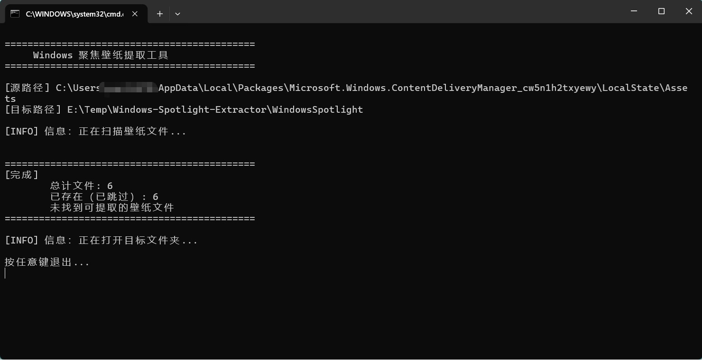

# 🖼️ Windows 聚焦壁纸提取工具 / Windows Spotlight Wallpaper Extractor

一键提取 Windows 聚焦（Windows Spotlight）的精美壁纸，保存为可直接查看的 JPG 图片。
One-click extractor for Windows Spotlight wallpapers, saving them as viewable JPG images.

[](LICENSE)

---

## 🌍 多语言支持 / Multi-Language Support

| 语言 / Language | 状态 / Status |
| ------------- | ----------- |
| 🇨🇳 简体中文     | ✅ 完全支持      |
| 🇺🇸 English  | ✅ 完全支持      |
| 🇭🇰 繁體中文     | ✅ 自动识别      |

脚本会根据系统区域设置自动切换显示语言。
The script automatically detects your system locale and switches display language accordingly.

---

## ✨ 功能特点 / Features

| 中文                                      | English                                                                                   |
| --------------------------------------- | ----------------------------------------------------------------------------------------- |
| 🔍 **自动定位** — 自动找到 Windows 聚焦壁纸的存储目录    | 🔍 **Auto-locate** — Automatically finds Windows Spotlight asset directory                |
| 🧠 **智能过滤** — 只提取大于 100KB 的文件（过滤缩略图/图标） | 🧠 **Smart filtering** — Extracts only files larger than 100KB (filters thumbnails/icons) |
| 🏷️ **自动命名** — 为无扩展名的资源文件添加 `.jpg` 后缀   | 🏷️ **Auto-rename** — Adds `.jpg` extension to extensionless asset files                  |
| 🔄 **去重跳过** — 已提取过的壁纸不会重复复制             | 🔄 **Deduplication** — Skips already extracted wallpapers                                 |
| 📂 **自动打开** — 提取完成后自动打开目标文件夹            | 📂 **Auto-open** — Automatically opens target folder after extraction                     |
| 🌍 **多语言** — 自动适配系统语言（中文/英文）            | 🌍 **Multi-language** — Auto-adapts to system language (Chinese/English)                  |

---

## 📥 下载使用 / Download & Usage

### 方法一：直接运行脚本 / Method 1: Run Script Directly (Recommended)

1. 下载 `ExtractSpotlight.bat` / Download `ExtractSpotlight.bat`
2. **双击运行** → 自动在当前目录创建 `WindowsSpotlight` 文件夹 / **Double-click** → Auto-creates `WindowsSpotlight` folder in current directory
3. 提取完成后自动打开文件夹 / Auto-opens folder after extraction

### 方法二：指定输出目录 / Method 2: Specify Output Directory

将文件夹**拖放到脚本上**，或命令行运行：
Drag a folder onto the script, or run from command line:

```bat
ExtractSpotlight.bat D:\MyWallpapers
ExtractSpotlight.bat "D:\My Wallpapers" 
```

